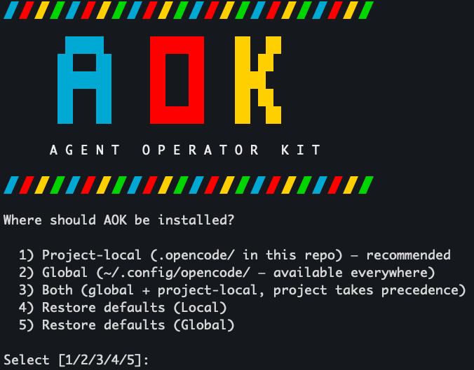

# AOK — Agent Operator Kit



A metaprompting framework for creating AI agents in [opencode](https://opencode.ai). AOK guides you from idea to verified, production-ready agent through an eval-driven workflow.

## Philosophy

1. **Agents are prompts.** The quality of an agent is the quality of its instructions.
2. **Tools add determinism.** Wherever possible, replace LLM judgment with deterministic tool calls.
3. **Skills encode conditional knowledge.** Procedural knowledge becomes a skill the agent can load on-demand, keeping the main prompt lean.
4. **Global Context is for universal rules.** Best practices and repo-wide conventions belong in `AGENTS.md`, not in individual agents or skills.
5. **Evals are not optional.** Every agent ships with an eval suite that proves it works.

## Quick Start

```
/aok-new            # Create the first iteration of your agent (idea → interview → generate → E2E test)
/aok-eval           # Run evals against ANY agent (AOK-created or not)
/aok-eval-compare   # Run evals across multiple models → comparison table
/aok-iterate        # Enhance agent (determinism injection, skill extraction, etc.) based on eval results
```

## Core Workflow

```
/aok-new (Iteration 1) → /aok-eval → /aok-iterate (Enhancements) → repeat until evals pass
```

Enhancements like **determinism injection**, **skill extraction**, and structural prompt refinement are typically added during the iteration phase after analyzing initial performance.

For **existing agents** (not created with AOK):
```
/aok-eval my-agent  → generates evals if none exist → runs them → comparison table
```

### Agent Auditing

The `/aok-audit` command analyzes an agent's prompt, tools, and skills to produce a structured security and efficiency report. It checks for:
- **Token waste**: Identifies prompt bloat and procedural knowledge that should be offloaded to a skill.
- **Injection surfaces**: Finds vectors where untrusted user input flows into unguarded LLM judgment.
- **Determinism gaps**: Suggests rigid tools or CLI commands to replace unreliable LLM reasoning.

AOK can automatically apply fixes based on the audit, such as adding input boundary markers (`<user_input>`), creating deterministic tools (while adhering to a strict "Beware of Tool Bloat" principle), and rewriting prompts for better structure.

| Command | Purpose |
|---------|---------|
| `/aok-new` | Create the **first iteration** of a new agent (interview → generate → scaffold → E2E test) |
| `/aok-eval` | Run eval suite against ANY agent — generates evals if none exist |
| `/aok-eval-compare` | Multi-model comparison — run same evals across different models |
| `/aok-audit` | Audit agent for token waste, injection surfaces, and determinism gaps. **Can automatically apply fixes.** |
| `/aok-iterate` | **Enhance agent** based on eval failures (determinism injection, skill extraction, prompt refinement) |
| `/aok-tools` | Add or update custom tools for an agent |
| `/aok-skill` | Create or update a skill for an agent |
| `/aok-delete` | Delete an agent and all associated artifacts (tools, skills, evals) |
| `/aok-help` | Show this reference |

## What Gets Generated

When you run `/aok-new`, AOK produces:

```
.opencode/
├── agents/
│   └── my-agent.md          # Agent definition (prompt + config)
├── commands/
│   └── my-agent.md          # Slash command to invoke the agent
├── tools/
│   └── my-agent-*.ts        # Deterministic tools for the agent
├── skills/
│   └── my-agent/
│       └── SKILL.md         # Procedural knowledge skill
└── evals/
    └── my-agent/
        ├── EVAL-SPEC.md     # Eval dimensions + rubrics
        ├── cases/           # Test cases (input → expected)
        └── results/         # Eval run results
```

## Installation

Run the install command from within opencode:
```
/aok-install
```

Or use the shell script directly:
```bash
./install.sh              # Interactive — asks local vs global
./install.sh --local      # Project-local (.opencode/)
./install.sh --global     # Global (~/.config/opencode/)
./install.sh --both       # Both locations
```

## Eval-Driven Development

AOK treats evals as the primary quality gate:

1. **Select** test types from the eval taxonomy based on what the agent does
2. **Generate** test cases (8-25) covering happy paths, edges, robustness, and adversarial inputs
3. **Run end-to-end** before shipping — issues found are fixed inline during creation
4. **Judge** outputs using code checks + LLM-as-judge rubrics
5. **Iterate** on the agent prompt/tools/skills until evals pass

### Eval Taxonomy

AOK includes a comprehensive catalog of test types (`references/eval-taxonomy.md`):

| Category | What It Tests |
|----------|---------------|
| **Behavioral** | Task completion, instruction following, tool usage, decisions, scope |
| **Structural** | Format compliance, completeness, length, consistency |
| **Robustness** | Empty input, adversarial, ambiguous, errors, overload |
| **Integration** | Tool E2E, skill loading, permissions, context usage |
| **Quality** | Accuracy, helpfulness, tone, reasoning |

The right tests are selected per-agent based on what it does — not every agent needs every test type.

### End-to-End Testing (Mandatory)

Every agent created with `/aok-new` is tested end-to-end before the workflow completes. If issues are found:
1. Root cause is diagnosed (prompt gap? missing tool? format issue?)
2. Fix is applied immediately
3. Regression case is added to the eval suite
4. E2E is re-run to confirm the fix
